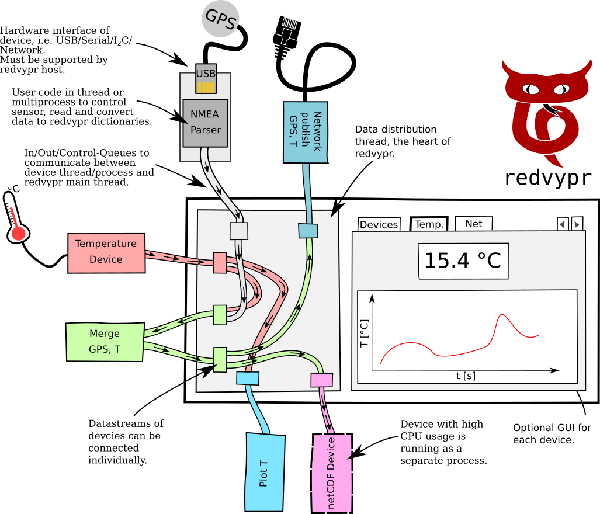

<h1 align="center"> </h1>

redvypr: RealtimeData Viewer and PRocessor (in PYthon)
======================================================

Overview
--------
Redvypr offers a [Python](https://www.python.org/) based framework to connect sensors and devices providing digital data and the possibilities to merge, process, redistribute and save the data. See figure below for an artistic overview of the general structure of redvypr:

Introduction
------------

Sampling data from sensors does always require similar tasks:

- Reading data from sensors
- Saving the data 
- Adding metainformation to the dataset, that typically includes
  information like time, location, experiment, responsible person(s),
  project ...
- Plotting data
- Do a dataanalysis

These tasks have been traditionally done by reading scales and documenting the data onto
paper. By the still continuing digitalisation of sensors, the number
of sensors and the amount of data output is increasing drastically.
Digital sensors have an non overseeable amount of interfaces like
UART, SPI, I2C, ethernet, CAN, to name a few, and their own data
format. Each sensor is typically shipped with its own software for
sampling.
The complexity starts if a user wants to fuse data from several sensors during sampling. An often used approach is to merge the data after the measurement. The users needs to read each dataset of each sensor, with the data containing most likely different data formats like time stamps, binary data or ASCII text. It is left to the user to synchronize the data and create a usable dataset.

Redvypr is a tool to help to work with digital sensors by providing a
Python based infrastructure allowing to add sensors, interconnect
sensors, process and save the data gathered by the sensors. Python is
choosen as the language as it provides a rich infrastructure of
packets to deal with digital data and its interfaces, i.e. using
network devices, databases or serial connections. The extensive usage 
of [queues](https://docs.python.org/3/library/queue.html), [threads](https://docs.python.org/3/library/threading.html) and [multiprocesses](https://docs.python.org/3/library/multiprocessing.html) allows to work with asynchronously received data from
various sensors. 

Please note that redvypr does not provide an interface to a specifc sensor, this needs to be coded by the user.

Redvypr was designed with the following goals in mind:
- Runs on small embedded systems
- Allows to work with asynchronously received data from multiple sensors
- Scalable by using several redvypr instances either on one computer or on a network
- Can be easily extended by users by the usage of modules to include a specific device/sensor
- Setup via a configuration file and an optional GUI

Documentation
-------------
Find [here](https://redvypr.readthedocs.io) the documentation of redvypr.

