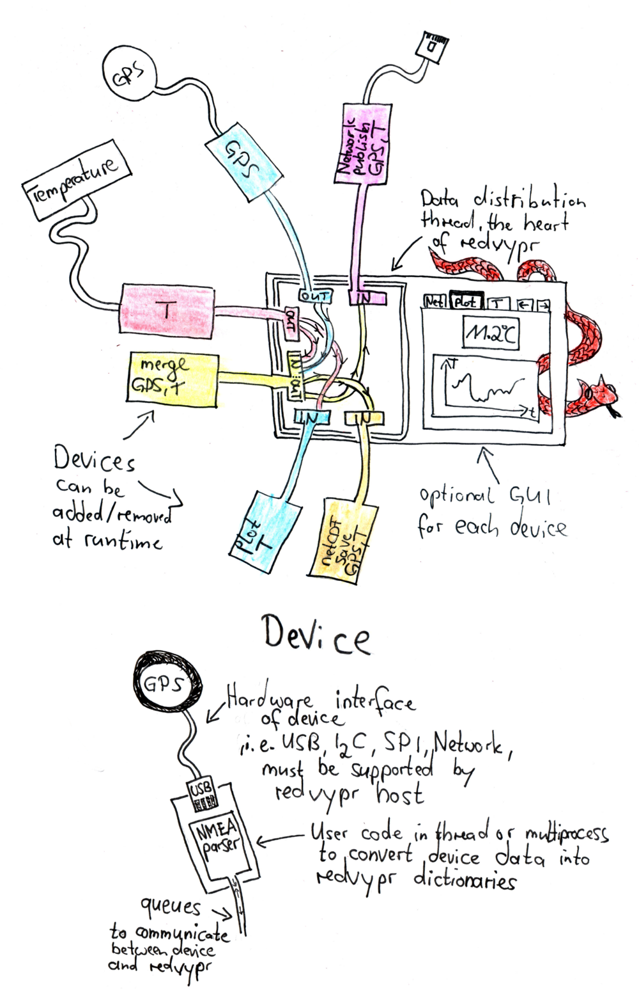

.. _python: https://www.python.org

redvypr
=======

redvypr stands for: Realtime data viewer and processor (in Python)

Introduction
------------

Sampling data does always require the similar tasks.

- Reading data from sensors
- Saving the data 
- Adding metainformation to the dataset, that typically includes
  information like time, location, experiment, responsible person(s),
  project ...
- Plotting data for a quicklook
- Do a first dataanalysis

Before the development of digital sensors these tasks have been
performed mainly by reading scales and documenting the data onto paper. 
By the still continuing digitalisation of sensors, the number of sensors
and the amount of data output is increasing drastically, which creates
challenges in performing the above mentioned tasks, especially if
several sensor need to be fusioned.

Digital sensors have an non overseeable amount of interfaces like
UART, SPI, I2C, ethernet, to name a few, and their own data
format. Sensors are generally shipped with their own software for
sampling. The complexity starts if a user wants to fuse data from
several sensors in realtime. This tasks does generally requires a
custom implementation for each sensor, which is a time consuming task.

Redvypr is a tool to help to work with digital sensors by providing a
`python`_ based infrastructure allowing to add sensors,
interconnect sensors, process and save the data gathered by the
sensors. Python is choosen as the language as it provides a rich
infrastructure of packets to deal with digital data and its
interfaces, i.e. using network devices, databases or serial
connections. 

What does it provide?
---------------------

Redvypr provides the infrastructure to distribute, save, display and
plot for datastream produced by digital sensors. New sensors can be
intregrated by creating an own device (Link to the device page here) ,
example devices are provided with redvypr. By solely using Python it
gives the user the flexibility to use the almost infinite number of
python packages to read and process their data.

Each devices runs in an own thread or an own process, which allows to
do multiprocessing.

What it is not?
---------------

Redvypr provides the infrastructure for sensor but does not provide
out of the box interfaces to the almost infinite number of different
sensor realizations. The user needs to write their own interface using
the API provided by redvypr. Since redvypr is written in Python it not
well designed for "fast" sensors, i.e. sensors with sampling rates
well above 100 Hz which need to be processed fast. The distribution is
on frequency scales of 100 Hz. The datapackets can be large though,
allowing to transport more data by one packet.

    

