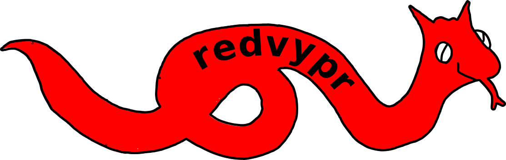

.. _python: https://www.python.org

redvypr
=======

redvypr stands for: Realtime data viewer and processor (in Python)

.. image:: figures/redvypr_overview_merged_v01_small.png
  :width: 1200
  :alt: Artistic view of redvyprs general structure

Introduction
------------

Sampling data does always require the similar tasks.

- Reading data from sensors
- Saving the data 
- Adding metainformation to the dataset, that typically includes
  information like time, location, experiment, responsible person(s),
  project ...
- Plotting data for a quicklook
- Do a first dataanalysis

Before the development of digital sensors these tasks have been
performed mainly by reading scales and documenting the data onto
paper. By the still continuing digitalisation of sensors, the number
of sensors and the amount of data output is increasing drastically,
which creates challenges in performing the above mentioned tasks,
especially if several sensor need to be fusioned, as they provide data
at transferred via different physical interfaces, different
frequencies, times and data formats:

Digital sensors have an non overseeable amount of interfaces like
UART, SPI, I2C, ethernet, to name a few, and their own data
format. Sensors are generally shipped with their own software for
sampling. The complexity starts if a user wants to fuse data from
several sensors in realtime. An often used approach is to merge the
data after the measurement. The data is typically located in several
files with different data formats. The users needs to read each data
format containing most likely different time stamps and data with the
complex task to synchronize the data and create a usable dataset.

Redvypr is a tool to help to work with digital sensors by providing a
`python`_ based infrastructure allowing to add sensors, interconnect
sensors, process and save the data gathered by the sensors. Python is
choosen as the language as it provides a rich infrastructure of
packets to deal with digital data and its interfaces, i.e. using
network devices, databases or serial connections. The extensive usage
of threads and multiprocesses allows to work with data received from
various sensors at different times and frequencies (asynchrone).

Redvypr was designed with the following goals in mind:
- Runs on small embedded systems
- Allows to work with asynchronously received data from multiple sensors
- Scalable by using several redvypr instances either on one computer or on a network
- Can be easily extended by users
- Setup via a configuration file and an optional GUI

What does it provide?
---------------------
Redvypr provides the infrastructure to distribute, save, display and
plot digital datastreams produced by sensors. New sensors can be
integrated by creating an own device, example devices are provided
with redvypr. By solely using Python it gives the user the flexibility
to use the almost infinite number of python packages to read and
process their data.

Each devices runs in an own thread or an own process, which allows to
do multiprocessing. Time or computationally intensive tasks are not
blocking the whole process, an example is the netCDF logger, that can
write on-the-fly compressed data provided by different sensors
(:ref:`GPS example <examplegps>`).

What it is not?
---------------

Redvypr provides the infrastructure for sensor but does not provide
out of the box interfaces to the almost infinite number of different
sensor realizations. The user needs to write their own interface using
the API provided by redvypr. Since redvypr is written in Python it is
not well designed for "fast" sensors, i.e. sensors with sampling rates
well above 100 Hz and need to be processed at the same
frequency. Despite this, redvypr is principally capable to buffer the
data and transport larger packets, avoiding a data loss. This data can
then be processed on lower frequencies by downstream devices.

    

